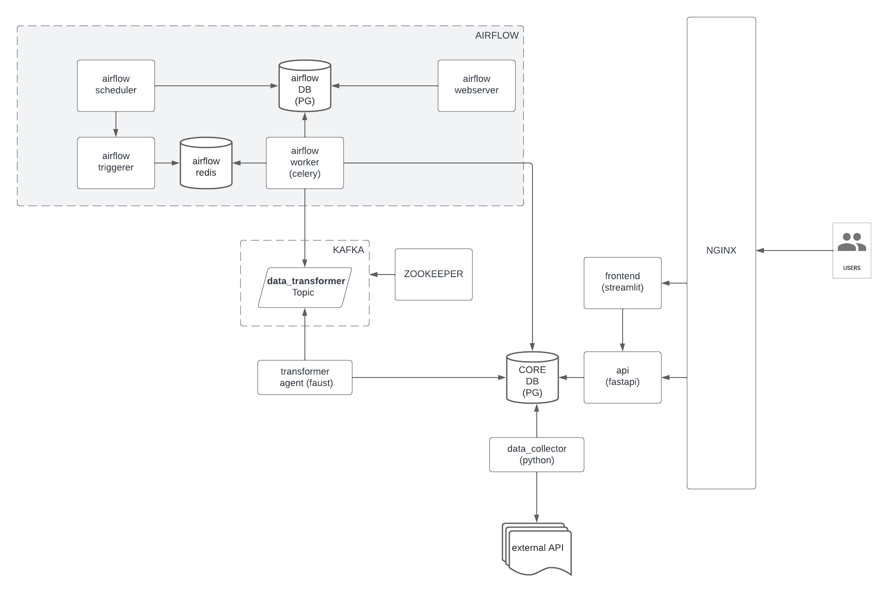

# Big Ear + UniToGo 👨‍🎓👩‍🎓

Find your perfect university fit with our app

## Architecture



## Links

* [Project web-page](http://84.201.178.7/) (build on [Streamlit](https://github.com/streamlit/streamlit))
* [API documentation](http://84.201.178.7/docs) (build on [Fastapi](https://github.com/tiangolo/fastapi))
* [Detailed project description](https://docs.google.com/document/d/1XrHEvw7chDHATpiYBnVK8PNxD9LxPhFZ/edit)

## Contributors

* [Edward Tuomas](https://github.com/ToyOwl) – Software Developer
* [Tatiana Anisimova](https://github.com/t-linguist) –  ML Engineer
* [Artem Golubev](https://github.com/arqoofficial) – Business Analyst
* [Alexey Gukov](https://github.com/brain4power) – MLOps Engineer
* [Vyacheslav Kolotiy](https://github.com/kv49) – PM
* [Viktor Roterman](https://github.com/ViktorRtm) – Test Automation Engineer

# Dev
```shell
cp configs/dev/.env .env
```
- add COLLECTOR_ACCESS_TOKEN to .env

up db
```shell
docker compose up -d --build h-data-pg
```
create tables
```shell
docker compose run --rm --no-deps data-collector sh -c 'python -m scripts.init_db_tables'
```
run collector
```shell
docker compose up -d --build data-collector
```
run all services
```shell
docker compose up -d --build
```

### utils
```shell
docker compose logs -n 100 data-collector
docker compose exec h-data-pg psql -U h_user -d h_core
```
```postgresql
UPDATE h_raw_data
SET about = regexp_replace(about, E'[\\n\\r]+', ' ', 'g' ),
    activities=regexp_replace(activities, E'[\\n\\r]+', ' ', 'g' ),
    books=regexp_replace(books, E'[\\n\\r]+', ' ', 'g' ),
    games=regexp_replace(games, E'[\\n\\r]+', ' ', 'g' ),
    interests=regexp_replace(interests, E'[\\n\\r]+', ' ', 'g' ),
    university_name=regexp_replace(university_name, E'[\\n\\r]+', ' ', 'g' ),
    faculty_name=regexp_replace(faculty_name, E'[\\n\\r]+', ' ', 'g' );

SELECT count(DISTINCT page_number)
FROM h_raw_data;

SELECT min(page_number)
FROM h_raw_data;

SELECT count(*)
FROM h_raw_data;

COPY h_raw_data TO '/csv/h_raw_data.csv' DELIMITER ',' CSV HEADER;

COPY (SELECT *
      FROM h_raw_data
      WHERE education_status IN
            ('Выпускник (бакалавр)', 'Выпускник (магистр)', 'Выпускник (специалист)', 'Выпускница (бакалавр)',
             'Выпускница (магистр)',
             'Выпускница (специалист)')) to '/csv/graduates.csv' with (format csv, DELIMITER ',', HEADER);
```
# Develop
create DB
```shell
cat configs/dev/h-data-pg/docker-entrypoint-initdb.d/0_initial_postgresql.sql | psql -U postgres
```
export env variables
```shell
export $(grep -v '^#' configs/dev/.env | xargs)
```
create DB tables
```shell
python -m src.data_collector.scripts.init_db_tables
```
